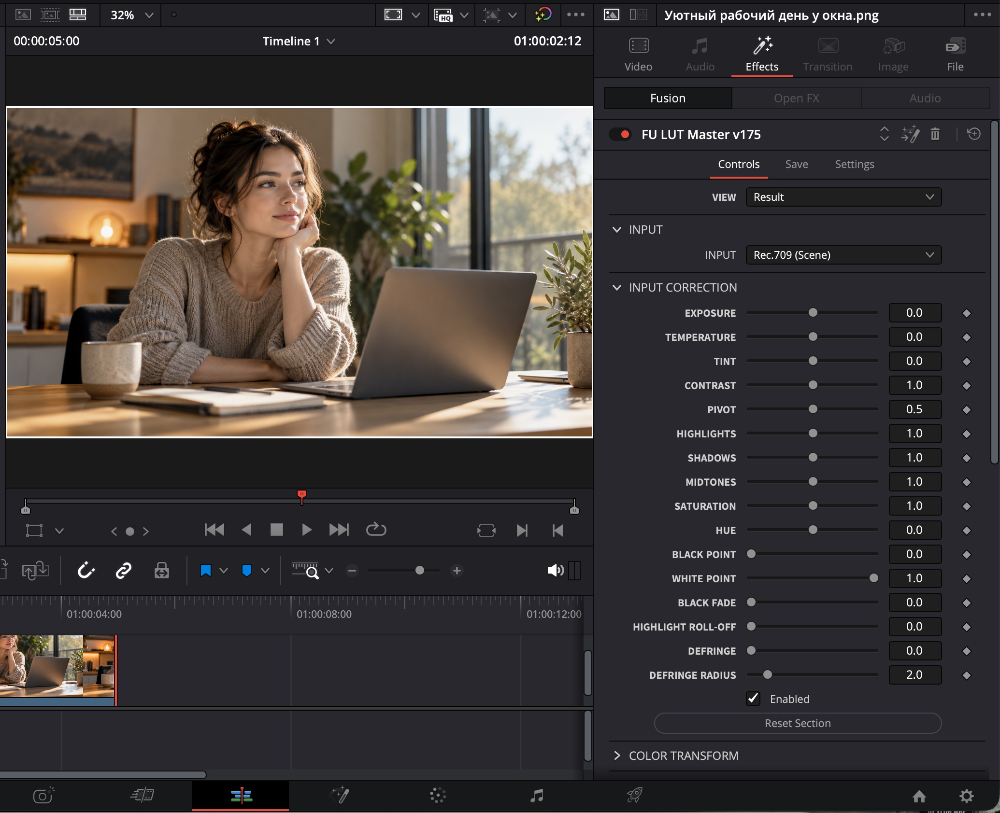
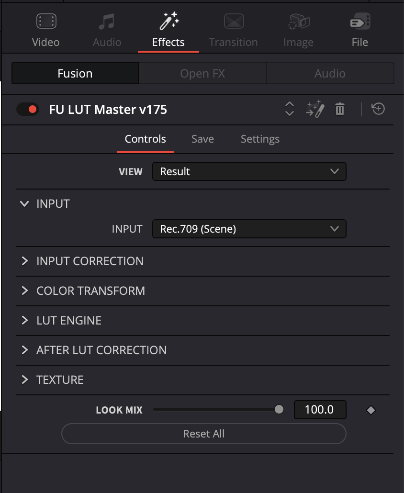
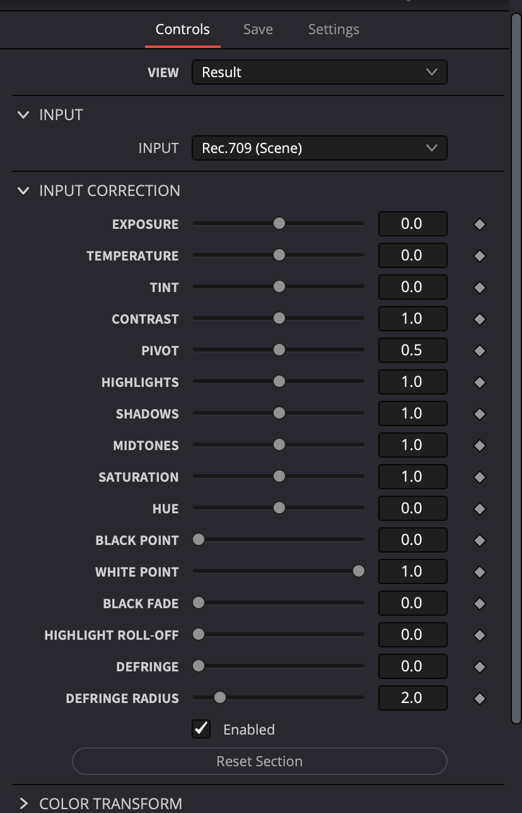
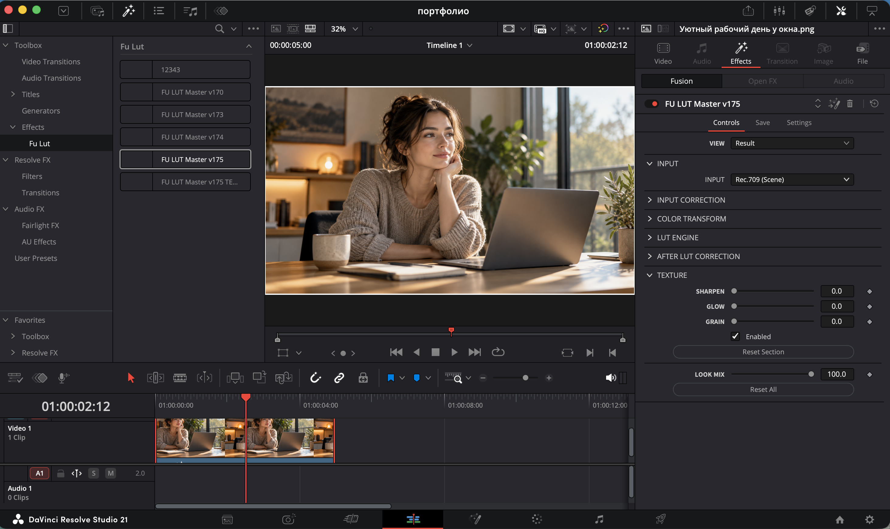
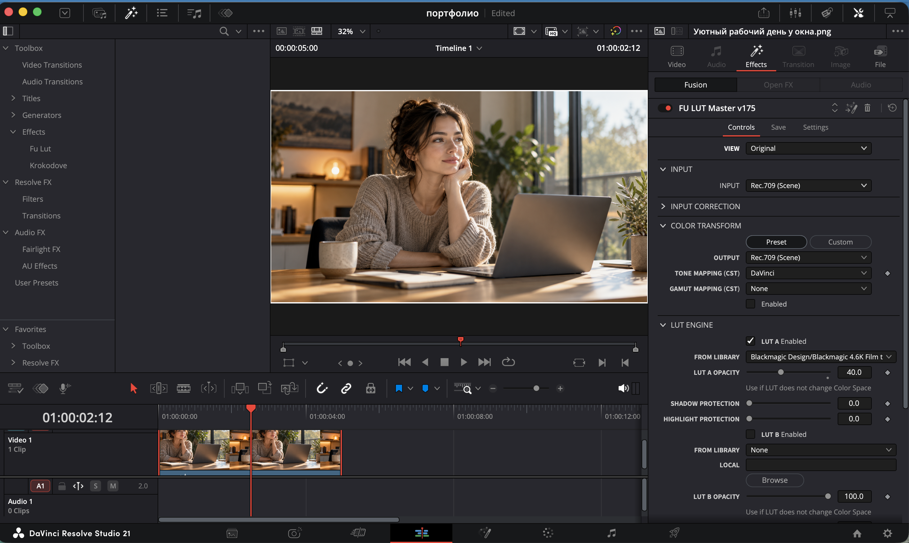
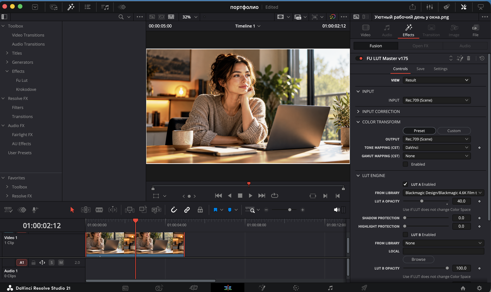
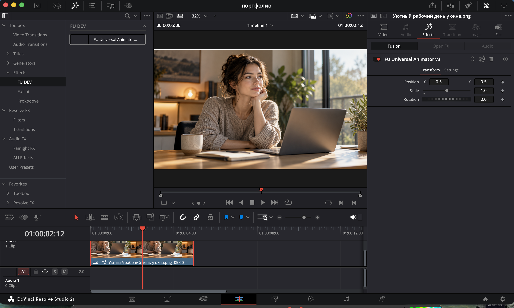
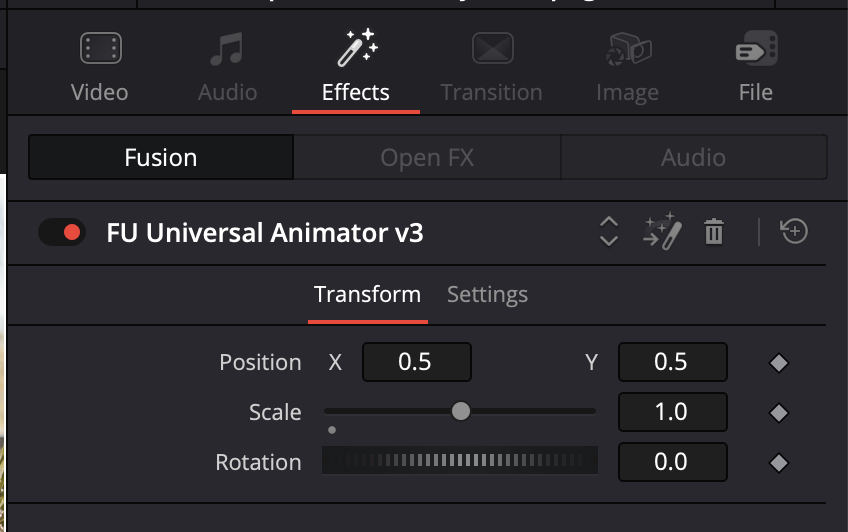
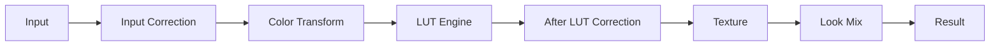

# Инструменты для DaVinci Resolve / Fusion

Коммерческий проект по созданию и доработке пользовательских инструментов для DaVinci Resolve / Fusion.

Проект выполнялся под реальные задачи рабочего процесса заказчика: от формулировки требований и структуры интерфейса до тестирования непосредственно в DaVinci Resolve и доведения инструментов до рабочего состояния.

## Моя роль

В проекте я занималась:

- разбором требований заказчика;
- проектированием логики инструментов;
- структурой пользовательских контролов;
- AI-assisted разработкой с ChatGPT / Codex;
- работой с инструментами Fusion;
- тестированием непосредственно в DaVinci Resolve;
- поиском и разбором ошибок;
- доработкой функций по результатам тестирования;
- подготовкой рабочих версий для заказчика.

AI использовался как инструмент разработки. Проверку логики, тестирование поведения и принятие решений по рабочим версиям я выполняла в рамках проекта самостоятельно.

## LUT Master

Пользовательский инструмент для работы с LUT и дополнительной обработкой изображения.

В проекте были реализованы:

- выбор LUT A и LUT B;
- смешивание двух LUT;
- управление интенсивностью результата;
- Bypass;
- режимы просмотра Original / Before / After A / After B / Result;
- Global Mix;
- Black Point;
- White Point;
- Black Fade;
- Highlight Roll-off;
- Sharpen;
- Glow;
- Grain;
- защита теней и светов при применении LUT;
- выбор входного цветового пространства;
- преобразование изображения с использованием механизмов DaVinci Resolve.

Отдельно тестировалось соответствие цветовых преобразований штатным инструментам DaVinci Resolve.

## Видео-демонстрация LUT Master

Короткая демонстрация работы инструмента в DaVinci Resolve.

[▶ Смотреть видео](demo/fu-lut-master-demo.mp4)
## Скриншоты LUT Master

### Общий вид

### Интерфейс инструмента

### Input Correction

### LUT Engine

### Texture

### До и после

<table>
  <tr>
    <td align="center"><b>Before</b></td>
    <td align="center"><b>After</b></td>
  </tr>
  <tr>
    <td></td>
    <td></td>
  </tr>
</table>
## Universal Animator

Экспериментальный инструмент для быстрого управления базовой анимацией объектов в Fusion.

На текущем этапе реализованы:

- Position;
- Scale;
- Rotation;
- отдельная секция Transform;
- интерфейс для использования на странице Edit.

Статус: в разработке.
## Скриншоты Universal Animator

### Общий вид

### Transform

## Логика LUT Master

Основные этапы обработки внутри инструмента:

## Технологии и инструменты

- DaVinci Resolve
- Fusion
- Fusion .setting / Fuse
- AI-assisted development
- ChatGPT
- Codex
- Git / GitHub

## Статус

Коммерческий проект.

Рабочая версия LUT-инструмента была завершена, проверена и передана заказчику.

Проект оплачен.

Разработка дополнительных инструментов для DaVinci Resolve / Fusion продолжается.

## Roadmap

- Продолжить разработку Universal Animator
- Добавить дополнительные варианты анимации
- Улучшить интерфейс и удобство управления
- Продолжить тестирование инструментов в DaVinci Resolve
- Подготовить дополнительные демонстрационные примеры
## Примечание

Исходный коммерческий код, файлы заказчика и закрытые материалы проекта в публичном репозитории не размещаются.

В репозитории представлены описание проекта, структура решения и безопасные демонстрационные материалы.
